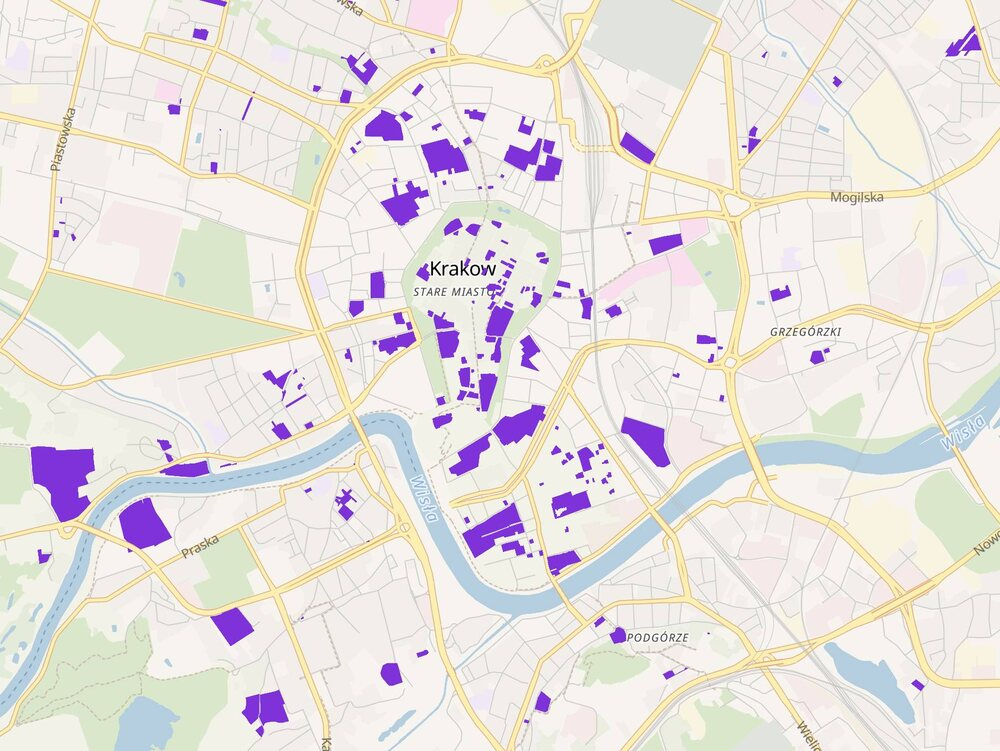

# Grunty Kościelne
Interaktywna mapa gruntów kościelnych (kościoły i związki wyznaniowe) z powiatowych Ewidencji Gruntów i Budynków.

Link: https://grunty-koscielne.github.io



Mapa jest niekompletna - dlaczego? Czytaj dalej.

# Dane źródłowe

Techniczne podstawy Ewidencji Gruntów i Budynków: https://www.geoportal.gov.pl/pl/dane/ewidencja-gruntow-i-budynkow-egib/

Zgodnie z obowiązującymi wymogami prawnymi (https://sip.lex.pl/akty-prawne/dzu-dziennik-ustaw/ewidencja-gruntow-i-budynkow-19135417), 
Ewidencja Gruntów i Budynków musi zawierać informację o grupie rejestrowej wskazującej na właściciela gruntu. 
Między innymi:

```
grupa 9 - kościoły i związki wyznaniowe;
```

Starostwa powiatowie publikują dane z EGiB za pomocą usług sieciowych (API) WFS oraz cyklicznie generowanych plików GML.

Połączony plik danych ze wszystkich powiatów publikuje równiez Geoportal:
https://gis-support.pl/dzialki-ewidencyjne-dla-calej-polski-do-pobrania-w-jednym-pliku/


W teorii wszystko gra, ale czy na pewno?

# Brakujące dane

Mimo, iz starostwa powiatowe obowiązuje schemat wymiany informacji w plikach - około 30% powiatów w 
kolumnie "grupa_rejestrowa" po prostu nie udostępnia żadnych danych 
(niezależnie od źródła - usługa WFS czy generowane pliki).

Problem zarówno występuje w mniejszych powiatach gdzie dominują gminy wiejske jak i w dużych miastach.
Co ciekawe, duże miasta w swoich geoportalach publikują własne mapy struktury własnościowej gruntów, ale "ocenzurowane"
w taki sposób że grunty z grupy rejestrowej 9 wrzucono hurtem do kategorii "osoby prawne". 

Czyli wiemy, że miasta te prowadzą ewidencję ale jej nie udostępniają. 
Czysto technicznie - zgodnie z ustawą "Prawo geodezyjne i kartograficzne" powiaty bezpłatnie mają 
obowiązek publikacji EGiB jedynie w zakresie identyfikatorów działek i ich geometrii. 
Najwyraźniej nie mają problemu aby udostępniać bezpłatnie również pozostałych informacji z tej bazy - ale pod warunkiem, iż
nie ma tam wyszczególnionych bezpośrednio informacji o działkach kościołów i związków wyznaniowych ;).

Na szczęście dla nas, niekiedy, przy odpowiednio dobrej znajomości oprogramowania ArcGIS MapServer na której 
pracują serwery GIS dużych miast i powiatów, można taki serwer (całkiem legalnie i z użyciem oficjalnego API!) ładnie poprosić o dane, które chcemy, a które urzędnicy przypadkowo zapomnieli udostępnić xD

Tak na przykład pobraliśmy i uzupełniliśmy w naszej bazie grunty dla miasta Krakowa. Pozdrawiamy!

## Znane braki

Największe miasta dla których dane o kościelnej własności gruntów nie są publikowane. Lista nie jest kompletna.

- Warszawa (ocenzurowana mapka własności gruntów)
- Katowice
- Kraków (dane uzyskane w sposób opisany powyżej)
- Wrocław - serwis WFS w kolumnie "grupa_rejestrowa" podaje "Brak uprawnień" xD. Opublikowana mapa własności gruntów jest "ocenzurowana".
- Rzeszów
- Gdańsk
